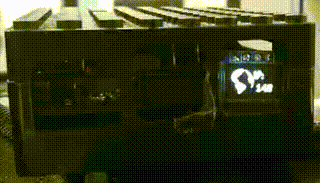

# SSD1306_64_32_Demo

A working demo using the SSDD1306 64x32 0.49" OLED display via I²C

I tinkered and googled alot to find a working solution to use these displays with a Raspberry Pi. As I used a 128x64 0.96" display before, that was my starting point.

This solution is by no means perfect but I was unable to find another working one for Python yet.

## What the script does

The left half of my display is reserved for an animation - I do not include one here but you can either comment the annimation lines out (and increese the sleep) or provide your own.

The right side switches beteween:

1. Last number of the DHCP IP address (via second (USB) WiFi card), if connected - I use 192.168.168.1 as my AP local address so I filter that out
2. The number of connected clients to my WiFi hotspot
3. The current CPU temperature
4. The current system time

## I²C bus speed

I advise to increese the baudrate on the I²C bus to improve refresh rates:

sudo nano /boot/config.txt

uncomment and/or edit the line with for i2c:

dtparam=i2c_arm=on,i2c_arm_baudrate=400000
